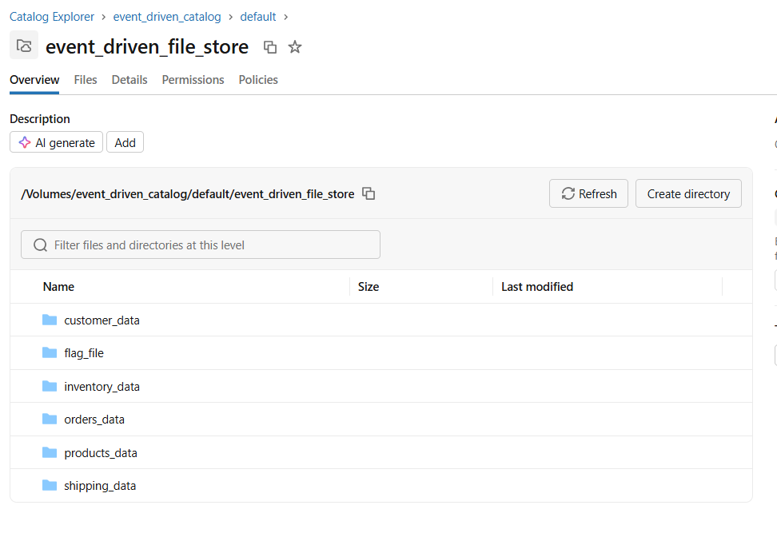
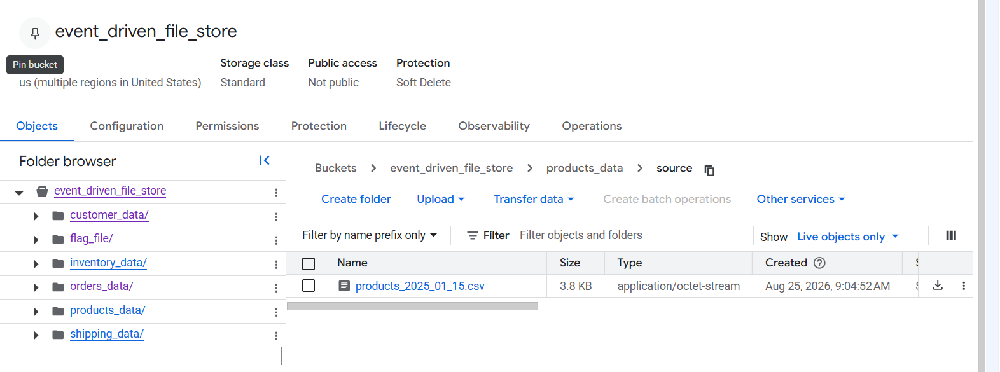
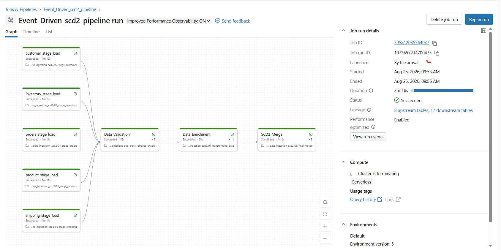
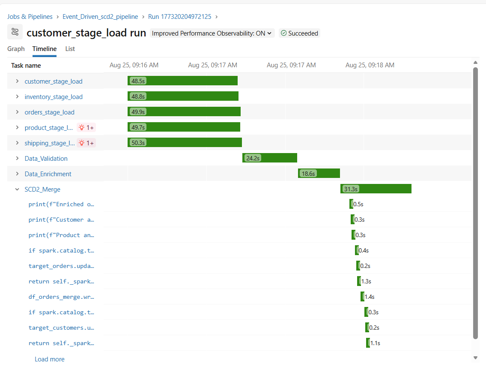
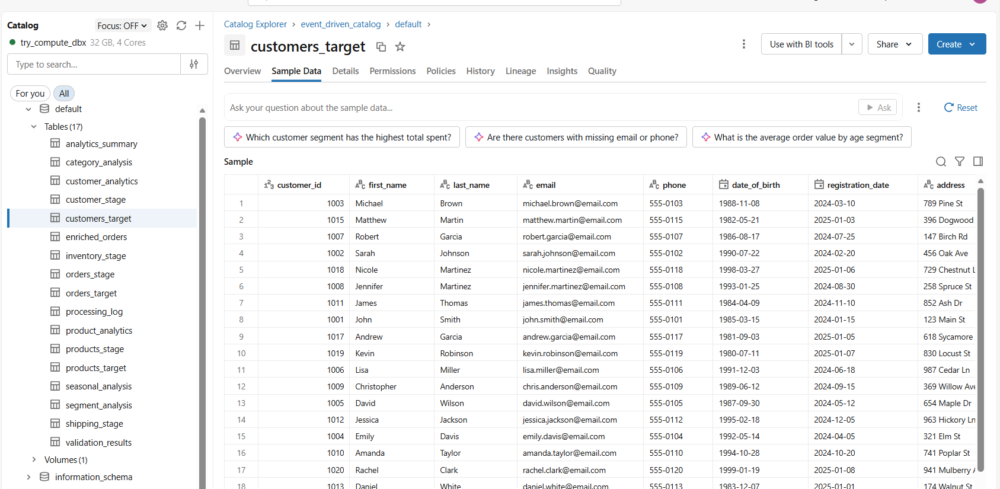
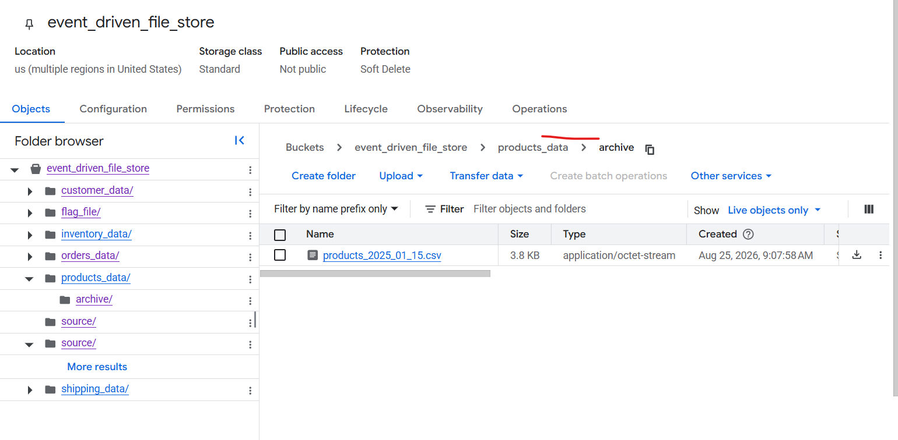

# Event-Driven Data Ingestion with SCD Type 2

This project demonstrates an event-driven data ingestion pipeline in Databricks. It ingests orders, customers, products, inventory, and shipping data from cloud object storage, validates and enriches the data, and merges the results into SCD Type 2 target tables. The design is cloud agnostic: Amazon S3, Azure Data Lake Storage Gen2, and Google Cloud Storage can all be used through Unity Catalog.

## Pipeline Flow

1. Stage orders
2. Stage customers
3. Stage products
4. Stage inventory
5. Stage shipping
6. Validate and cross-reference data
7. Enrich the validated data
8. Merge data into SCD Type 2 target tables

Run the notebooks in this order:

- `01_stage_orders.ipynb`
- `02_stage_customer.ipynb`
- `03_stage_product.ipynb`
- `04_stage_inventory.ipynb`
- `05_stage_shipping.ipynb`
- `06_Validations_and_cross_refrence_checks.ipynb`
- `07_transforming_data.ipynb`
- `08_final_merge.ipynb`

## Prerequisites

You need:

- A Databricks workspace with Unity Catalog enabled
- An object-storage location in AWS S3, Azure ADLS Gen2, or Google Cloud Storage
- Permission to create or use a cloud storage credential, Databricks external location, volume, tables, and Jobs/Lakeflow Jobs
- Permission to create or use the cloud provider identity used by Databricks, such as an AWS IAM role, Azure managed identity/service principal, or GCP service account
- A GitHub account or another Git provider account
- A Git personal access token with permission to read this repository
- A Databricks SQL warehouse or compatible compute resource

The notebooks use these Unity Catalog paths:

```text
event_driven_catalog.default
/Volumes/event_driven_catalog/default/event_driven_file_store/
```

## Setup for a New Databricks Account

### 1. Create a cloud storage location

Create or select a private object-storage location in your preferred cloud provider. The storage location can be:

```text
AWS:   s3://<your-bucket>/<optional-prefix>
Azure: abfss://<container>@<storage-account>.dfs.core.windows.net/<optional-prefix>
GCP:   gs://<your-bucket>/<optional-prefix>
```

The notebooks do not read these provider URIs directly. Databricks accesses the location through a Unity Catalog external location and exposes it to the notebooks through `/Volumes/...`.

### 2. Configure the cloud identity and permissions

Create or select the identity Databricks will use to access the storage location:

- **AWS:** IAM role or instance profile with access to the S3 bucket and prefix.
- **Azure:** managed identity or service principal with the required ADLS Gen2 RBAC and ACL permissions.
- **GCP:** service account with access to the GCS bucket and prefix.

Grant the identity enough access to list and read source files, create archived files, and move or delete objects when archiving. Use the most restrictive provider-specific role and path permissions allowed by your organization.

Do not commit cloud credentials, service-account keys, client secrets, or tokens to this repository.

### 3. Create the Databricks external location

In Databricks Catalog Explorer:

1. Create a storage credential using the cloud identity configured in the previous step.
2. Create an external location for the S3, ADLS Gen2, or GCS URI.
3. Grant access to the user or group that will run the pipeline.

An account administrator or metastore administrator may need to perform these steps. The runner needs access to the external location and permissions equivalent to:

```sql
USE CATALOG ON CATALOG event_driven_catalog;
USE SCHEMA ON SCHEMA event_driven_catalog.default;
CREATE VOLUME ON SCHEMA event_driven_catalog.default;
CREATE TABLE ON SCHEMA event_driven_catalog.default;
```

### 4. Create the Unity Catalog catalog, schema, and volume

Run this in a Databricks SQL editor or notebook after the external location is available. Use an external volume when the files should remain in your cloud storage location; use a managed volume when Databricks should manage the storage location:

```sql
CREATE CATALOG IF NOT EXISTS event_driven_catalog;
CREATE SCHEMA IF NOT EXISTS event_driven_catalog.default;
-- For an external volume, add the LOCATION clause with your provider URI.
CREATE VOLUME IF NOT EXISTS event_driven_catalog.default.event_driven_file_store;
```

The notebooks expect this directory structure:

```text
/Volumes/event_driven_catalog/default/event_driven_file_store/
├── customer_data/source/
├── customer_data/archive/
├── inventory_data/source/
├── inventory_data/archive/
├── orders_data/source/
├── orders_data/archive/
├── products_data/source/
├── products_data/archive/
├── shipping_data/source/
└── shipping_data/archive/
```



### 5. Upload source files

Upload the input CSV files into the appropriate `source` directories. Successfully processed files are moved to the matching `archive` directories.



### 6. Connect the repository to Databricks Git folders

In Databricks Workspace, select **Git folders** and **Clone repository**. Enter the repository URL, authenticate through the Databricks Git integration using a Git personal access token, and select the branch to run. Keep the token in the Git integration or secret management system; do not put it in a notebook.

### 7. Create the Databricks workflow

The file [resources/event_driven_scd2_pipeline.yml](resources/event_driven_scd2_pipeline.yml) is a documentation-only example of the job structure. It is intentionally not a deployable Asset Bundle. It shows the job trigger, parallel staging tasks, and downstream dependencies. Adapt it to your workspace's job creation method.

```text
resources/event_driven_scd2_pipeline.yml
```

When creating the job, replace these placeholders from the YAML:

```yaml
existing_cluster_id: <your-existing-cluster-id>
notebook_path: /Workspace/Shared/<project-folder>/<notebook-name>
```

The five staging tasks can run in parallel:

```text
customer_stage_load  ─┐
inventory_stage_load  ├──> Data_Validation ──> Data_Enrichment ──> SCD2_Merge
orders_stage_load     ┤
product_stage_load    ┤
shipping_stage_load  ─┘
```

The job-level file-arrival trigger watches:

```text
/Volumes/event_driven_catalog/default/event_driven_file_store/flag_file/
```

Upload or create a flag file in that directory after the entity source files are ready. The trigger does not automatically watch every `source/` directory. Set `pause_status` to `PAUSED` in `resources/event_driven_scd2_pipeline.yml` when you want to deploy the job without immediately enabling the trigger.

File-arrival triggers may require Databricks file events or cloud notification permissions for the external location. A schedule or manual trigger can be used instead when those event permissions are not available.

### File-arrival trigger permissions

The job owner or service principal needs permission to create and manage the job trigger. The identity used by the job also needs access to the volume and its external location. Depending on the workspace and cloud provider, an administrator may need to enable file events and grant the storage credential permission to:

- List objects in the watched storage location
- Read the arriving flag file
- Access the external location and volume through Unity Catalog
- Use the catalog and schema containing the volume

If the workspace uses provider-managed notifications rather than Databricks-managed file events, additional cloud permissions may be required: AWS S3 event/SNS/SQS permissions, Azure Event Grid or storage queue permissions, or GCP Cloud Storage/Pub/Sub permissions. These permissions are for detecting the arrival event; they are separate from the notebook permissions used to read and archive data.

## Running the Pipeline

1. Confirm that source files are present.
2. Confirm that the external location and volume are accessible.
3. Start the Databricks workflow.
4. Monitor the staging, validation, enrichment, and merge tasks.
5. Confirm that processed files move to the archive directories.
6. Verify the target tables in Unity Catalog.

## Successful Run

The completed workflow shows successful staging, validation, enrichment, and SCD2 merge tasks:



The task run completes successfully across the pipeline stages:



After the merge, the target tables contain the processed records in SCD Type 2 format:



Successfully processed source files are archived:



## Output Tables

Tables are created or updated in `event_driven_catalog.default`, including:

```text
orders_target
customers_target
products_target
inventory_target
shipping_target
enriched_orders
customer_analytics
product_analytics
analytics_summary
seasonal_analysis
segment_analysis
category_analysis
validation_results
processing_log
```

## Troubleshooting

### Permission denied

Verify the external location, storage credential, cloud identity IAM/RBAC policy, any required storage ACLs, and Databricks `USE CATALOG`, `USE SCHEMA`, volume, and table permissions.

### No files are detected

Check that files are under the correct path:

```text
/Volumes/event_driven_catalog/default/event_driven_file_store/<entity>_data/source/
```

Also check whether the files were already moved to the corresponding `archive` directory.

### Table not found

Run the notebooks in sequence. Validation, enrichment, and merge depend on tables created by the earlier staging notebooks.